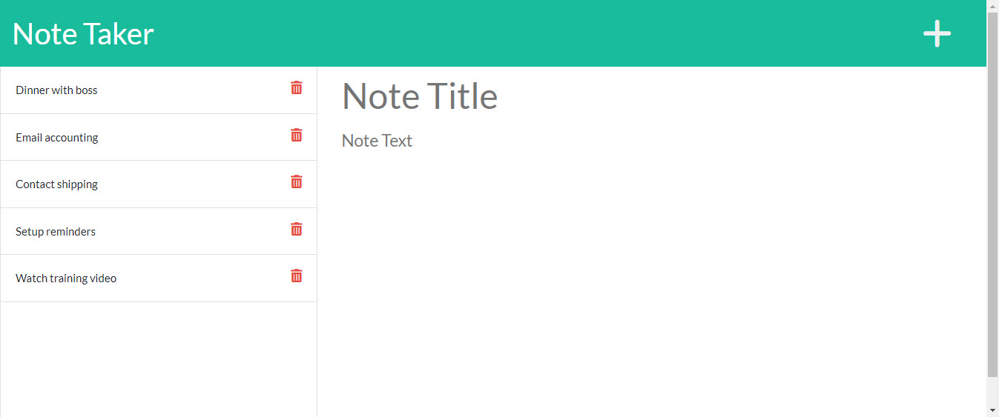

# Note Taker

## Description

Take notes with the Note Taker application. Allow yourself to place small notes into the application and store them externally to restore them between browser sessions. . Never lose a thought again.

---

## Table of Contents

- [Installation](#installation)
- [Usage](#usage)
- [Contributing](#contributing)
- [Tests](#tests)
- [Questions](#questions)

---

## Installation

To install, clone the respository to your local machine. Run a node install and npm init to download the required npm packages (requires npm express library).

---

## Usage

Free to use for personal usage.

---

## Contributing

If you share, please provide a link to this repository.

---

## Tests

Tests were not created for this application.

---

## Questions

Please contact the owner with any questions.
Email: yiladien@hotmail.com
GitHub profile: https://github.com/Yiladien

---
